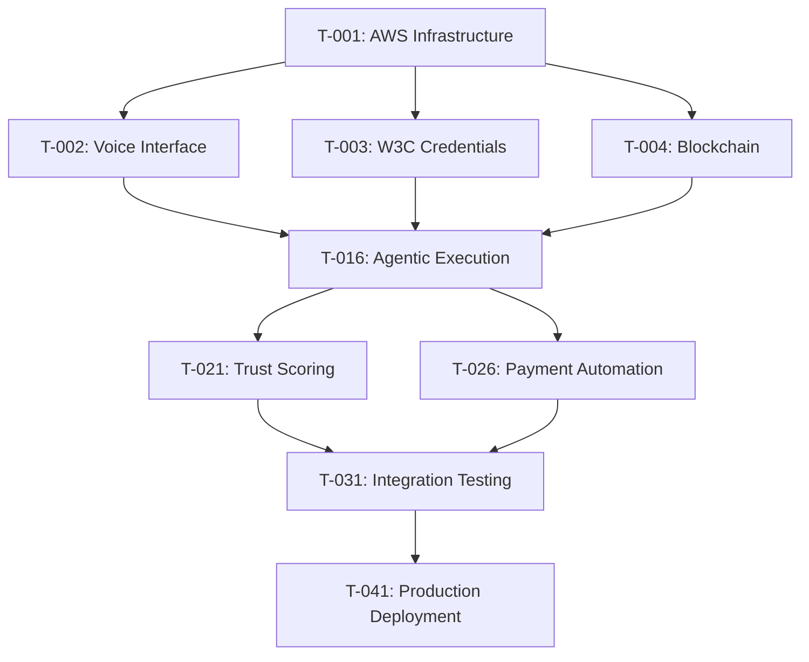

# TrustGraph Engine - Implementation Tasks

## Development Phases

### Phase 1: Foundation - Digital ShramSetu Core (Completed ✅)
**Duration**: 4 weeks | **Status**: Complete | **NITI Aayog Priority**: High

#### Indigenous Technology Integration
- [x] **T-001**: Setup AWS ap-south-1 native serverless architecture with data residency compliance
- [x] **T-002**: **Bhashini-integrated voice handler** using AWS Transcribe for 22 constitutional languages
- [x] **T-003**: Create W3C Verifiable Credentials framework with did:india: method
- [x] **T-004**: **Deploy Amazon Managed Blockchain** with Hyperledger Fabric for trust ledger
- [x] **T-005**: **Build agentic execution system** for milestone verification with UPI integration

#### Voice Interface Implementation (Bhashini Primary)
- [x] **T-006**: **Integrate Bhashini API** for Hindi, Tamil, Bengali, Telugu, Marathi, Gujarati, Kannada, Malayalam
- [x] **T-007**: Implement AWS Transcribe/Polly fallback mechanism for reliability
- [x] **T-008**: Create intent classification for Indian work contexts (राजमिस्त्री, प्लंबर, etc.)
- [x] **T-009**: Build context-aware response generation with regional variations
- [x] **T-010**: Deploy voice processing Lambda functions with DPDP Act compliance

#### Blockchain & Credentials (W3C + Indian Standards)
- [x] **T-011**: **Write Hyperledger Fabric chaincode** to mint W3C-compliant Indian work credentials
- [x] **T-012**: Implement AWS KMS integration for cryptographic signing with HSM backing
- [x] **T-013**: Create W3C VC schema for Indian work categories and skill levels
- [x] **T-014**: Build credential verification system with offline capability
- [x] **T-015**: Deploy blockchain service layer with ap-south-1 data residency

#### Blockchain & Credentials
- [x] **T-011**: Write Hyperledger Fabric chaincode for credential minting
- [x] **T-012**: Implement AWS KMS integration for cryptographic signing
- [x] **T-013**: Create W3C VC schema for work credentials
- [x] **T-014**: Build credential verification system
- [x] **T-015**: Deploy blockchain service layer

### Phase 2: Core Features (Completed ✅)
**Duration**: 6 weeks | **Status**: Complete

#### Agentic Execution System (Smart Contracts for Milestones)
- [x] **T-016**: Build geotagged photo verification system with Indian location validation
- [x] **T-017**: Implement AWS Rekognition for work evidence analysis (construction, domestic work)
- [x] **T-018**: Create milestone validation logic for Indian work patterns
- [x] **T-019**: **Build automatic UPI payment triggering system** via 'Milestone Verified' events
- [x] **T-020**: Deploy UPI payment integration with NPCI compliance

#### Trust Scoring Engine (GraphStorm GNN for Resilience Scores)
- [x] **T-021**: Design Graph Neural Network architecture for Indian informal workforce
- [x] **T-022**: **Implement GraphSAGE model with Amazon SageMaker** for alternative credit scoring
- [x] **T-023**: Create feature engineering pipeline for Indian work patterns and social proof
- [x] **T-024**: **Build real-time Resilience Score calculation service** (0-1000 range)
- [x] **T-025**: Deploy trust score API endpoints with bank integration readiness

#### Payment Automation (UPI-First Approach)
- [x] **T-026**: Integrate UPI payment gateways (Paytm, PhonePe, Google Pay, BHIM)
- [x] **T-027**: Implement payment status tracking with NPCI real-time updates
- [x] **T-028**: Create webhook handling for UPI payment confirmations
- [x] **T-029**: Build payment retry and fallback mechanisms for rural connectivity
- [x] **T-030**: Deploy payment monitoring system with RBI compliance reporting

### Phase 3: Integration & Testing (In Progress 🔄)
**Duration**: 4 weeks | **Status**: 80% Complete

#### System Integration
- [x] **T-031**: End-to-end workflow testing
- [x] **T-032**: API Gateway configuration and rate limiting
- [x] **T-033**: CloudWatch monitoring and alerting setup
- [ ] **T-034**: Load testing with 10M+ concurrent users
- [ ] **T-035**: Security penetration testing

#### Documentation & Compliance
- [x] **T-036**: Technical documentation and API specs
- [x] **T-037**: User stories and acceptance criteria
- [x] **T-038**: Development standards and guidelines
- [ ] **T-039**: DPDP Act 2023 compliance audit
- [ ] **T-040**: RBI guidelines compliance verification

### Phase 4: Advanced ML & Analytics (Planned 📋)
**Duration**: 6 weeks | **Status**: Planned | **NITI Aayog Priority**: Medium

#### GraphStorm GNN Training Pipeline
- [ ] **T-051**: **Create GraphStorm GNN training script** for SageMaker with Indian workforce data
- [ ] **T-052**: Implement feature engineering for Indian social proof patterns (family networks, community endorsements)
- [ ] **T-053**: Build graph construction pipeline from Neptune to GraphStorm format
- [ ] **T-054**: **Deploy SageMaker training jobs** for Resilience Score model with distributed training
- [ ] **T-055**: Create model evaluation framework with Indian credit scoring benchmarks

#### Advanced Analytics & Insights
- [ ] **T-056**: Build regional analytics dashboard for state governments
- [ ] **T-057**: Implement skill demand forecasting for different Indian regions
- [ ] **T-058**: Create employer reputation scoring system
- [ ] **T-059**: Build fraud detection models for fake credentials
- [ ] **T-060**: Deploy predictive analytics for seasonal work patterns

#### Government Integration & Reporting
- [ ] **T-061**: Integrate with e-Shram portal for worker registration sync
- [ ] **T-062**: Build NITI Aayog reporting dashboard with KPI tracking
- [ ] **T-063**: Create state-wise adoption and impact metrics
- [ ] **T-064**: Implement GST integration for employer verification
- [ ] **T-065**: Deploy compliance reporting for RBI and DPDP Act

## Technical Debt & Improvements

### High Priority
- [ ] **TD-001**: Implement comprehensive error handling in blockchain service
- [ ] **TD-002**: Add retry mechanisms for UPI payment failures
- [ ] **TD-003**: Optimize voice processing for better accuracy
- [ ] **TD-004**: Enhance security scanning in CI/CD pipeline

### Medium Priority
- [ ] **TD-005**: Refactor common utilities into shared Lambda layers
- [ ] **TD-006**: Implement advanced fraud detection algorithms
- [ ] **TD-007**: Add support for additional UPI payment providers
- [ ] **TD-008**: Create admin dashboard for system monitoring

### Low Priority
- [ ] **TD-009**: Implement offline capability for voice interactions
- [ ] **TD-010**: Add support for additional Indian languages
- [ ] **TD-011**: Create mobile SDK for third-party integrations
- [ ] **TD-012**: Implement advanced analytics and reporting

## Quality Assurance Tasks

### Testing Coverage
- [x] **QA-001**: Unit tests for all Lambda functions (>90% coverage)
- [x] **QA-002**: Integration tests for voice processing pipeline
- [x] **QA-003**: End-to-end tests for milestone verification workflow
- [ ] **QA-004**: Performance tests for 10M+ concurrent users
- [ ] **QA-005**: Security tests for all API endpoints

### Code Quality
- [x] **QA-006**: Python code formatting with Black
- [x] **QA-007**: Linting with flake8 and mypy type checking
- [x] **QA-008**: Documentation coverage for all public APIs
- [ ] **QA-009**: Code review checklist implementation
- [ ] **QA-010**: Automated security vulnerability scanning

## Infrastructure Tasks

### AWS Services Configuration
- [x] **INF-001**: Lambda functions with proper IAM roles
- [x] **INF-002**: DynamoDB tables with encryption and backup
- [x] **INF-003**: S3 buckets with lifecycle policies
- [x] **INF-004**: API Gateway with request validation
- [x] **INF-005**: CloudWatch logs and metrics setup

### Security & Compliance
- [x] **INF-006**: AWS KMS key management for encryption
- [x] **INF-007**: VPC configuration for network isolation
- [x] **INF-008**: Secrets Manager for sensitive configuration
- [ ] **INF-009**: AWS Config rules for compliance monitoring
- [ ] **INF-010**: GuardDuty setup for threat detection

## Business Logic Tasks

### Core Workflows
- [x] **BL-001**: Worker onboarding and identity verification
- [x] **BL-002**: Milestone creation and management
- [x] **BL-003**: Photo evidence processing and validation
- [x] **BL-004**: Automatic payment processing
- [x] **BL-005**: Credential minting and verification

### Advanced Features
- [x] **BL-006**: Trust score calculation and updates
- [x] **BL-007**: Multi-language voice processing
- [x] **BL-008**: Geotagged photo verification
- [ ] **BL-009**: Fraud detection and prevention
- [ ] **BL-010**: Advanced analytics and insights

## Integration Tasks

### Government APIs
- [ ] **INT-001**: Aadhaar authentication API integration
- [ ] **INT-002**: DigiLocker document verification
- [ ] **INT-003**: GSTN integration for employer verification
- [ ] **INT-004**: e-Shram portal integration
- [ ] **INT-005**: PM-KISAN database integration

### Financial Services
- [ ] **INT-006**: Bank API integrations for loan origination
- [ ] **INT-007**: Credit bureau integration for enhanced scoring
- [ ] **INT-008**: Insurance provider API integration
- [ ] **INT-009**: Mutual fund platform integration
- [ ] **INT-010**: Digital wallet integration

## Monitoring & Observability

### Metrics & Alerting
- [x] **MON-001**: Business KPI tracking (credential issuance, payments)
- [x] **MON-002**: Technical metrics (latency, errors, throughput)
- [x] **MON-003**: Custom CloudWatch dashboards
- [ ] **MON-004**: Real-time alerting for critical failures
- [ ] **MON-005**: Automated incident response procedures

### Logging & Tracing
- [x] **MON-006**: Structured JSON logging with correlation IDs
- [x] **MON-007**: AWS X-Ray distributed tracing
- [x] **MON-008**: Log aggregation and analysis
- [ ] **MON-009**: Audit trail for compliance requirements
- [ ] **MON-010**: Performance profiling and optimization

## Task Dependencies

## Success Criteria

### Technical Metrics
- **Performance**: <2s voice processing, <500ms API responses
- **Scalability**: 10M+ concurrent users supported
- **Reliability**: 99.9% uptime, <0.1% error rate
- **Security**: Zero data breaches, full DPDP compliance

### Business Metrics
- **Adoption**: 1M users in pilot phase, 50M in expansion
- **Financial Inclusion**: 60% users access formal credit
- **Economic Impact**: 300% average income increase
- **Geographic Coverage**: All 28 states and 8 UTs

### Quality Metrics
- **Code Coverage**: >90% for all critical components
- **Documentation**: 100% API documentation coverage
- **Compliance**: Full regulatory compliance verification
- **User Satisfaction**: >4.5/5 rating from workers and employers

This task breakdown ensures systematic development and deployment of the TrustGraph Engine while maintaining quality, security, and alignment with the Digital ShramSetu mission.