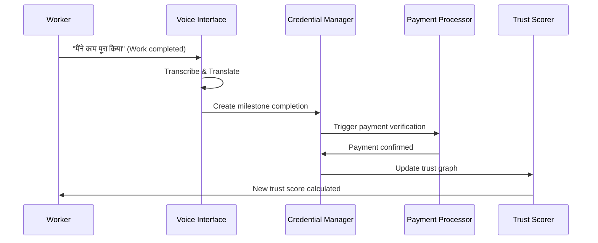

# TrustGraph Engine - Technical Design for Digital ShramSetu

## 1. Architecture Overview - Indian Context

### 1.1 System Philosophy: Atmanirbhar Digital Infrastructure
The TrustGraph Engine embodies **Atmanirbhar Bharat** principles through a **serverless-first, voice-native** architecture designed specifically for India's diverse linguistic and socio-economic landscape. The system prioritizes:

- **Bharatiya Languages**: Voice-first interactions in 22+ constitutional languages via Bhashini
- **Digital Sovereignty**: Self-sovereign identity with user-controlled data (DPDP Act 2023)
- **Inclusive Scale**: AWS serverless infrastructure for 490M+ informal workers
- **Trust & Transparency**: Cryptographic verification with blockchain immutability
- **Financial Inclusion**: Bridge the credit gap for 300 million unbanked workers

### 1.2 NITI Aayog Digital ShramSetu Integration
```
┌─────────────────────────────────────────────────────────────────┐
│                    Digital ShramSetu Platform                   │
├─────────────────────────────────────────────────────────────────┤
│  ┌─────────────────┐  ┌─────────────────┐  ┌─────────────────┐  │
│  │ Bhashini Voice  │  │ Trust Graph AI  │  │ Blockchain      │  │
│  │ Interface       │  │ (SageMaker)     │  │ Ledger          │  │
│  │                 │  │                 │  │                 │  │
│  │ • 22 Languages  │  │ • Neptune Graph │  │ • Hyperledger   │  │
│  │ • Transcribe    │  │ • GraphStorm    │  │ • W3C VCs       │  │
│  │ • Polly TTS     │  │ • GNN Scoring   │  │ • Smart Contracts│  │
│  └─────────────────┘  └─────────────────┘  └─────────────────┘  │
│           │                     │                     │          │
│           └─────────────────────┼─────────────────────┘          │
│                                 │                                │
│  ┌─────────────────────────────────────────────────────────────┐ │
│  │              Indian Digital Infrastructure                  │ │
│  │                                                             │ │
│  │ Aadhaar • UPI • DigiLocker • e-Shram • GST • Jan Aushadhi  │ │
│  └─────────────────────────────────────────────────────────────┘ │
│                                 │                                │
│  ┌─────────────────────────────────────────────────────────────┐ │
│  │                AWS India (ap-south-1)                       │ │
│  │                                                             │ │
│  │ S3 • Lambda • Neptune • SageMaker • KMS • Managed Blockchain│ │
│  └─────────────────────────────────────────────────────────────┘ │
└─────────────────────────────────────────────────────────────────┘
```

## 2. Data Architecture

### 2.1 Verifiable Credentials Schema
```json
{
  "@context": [
    "https://www.w3.org/2018/credentials/v1",
    "https://trustgraph.gov.in/contexts/work/v1"
  ],
  "type": ["VerifiableCredential", "WorkCredential"],
  "issuer": {
    "id": "did:india:employer:12345",
    "name": "ABC Construction Ltd"
  },
  "issuanceDate": "2026-01-25T10:00:00Z",
  "expirationDate": "2027-01-25T10:00:00Z",
  "credentialSubject": {
    "id": "did:india:worker:67890",
    "workDetails": {
      "jobType": "Mason",
      "skillLevel": "Intermediate",
      "duration": "30 days",
      "location": {
        "address": "Sector 4, Noida",
        "coordinates": [28.5355, 77.3910]
      },
      "compensation": {
        "amount": 15000,
        "currency": "INR",
        "paymentMethod": "UPI"
      },
      "performance": {
        "rating": 4.5,
        "completionRate": 100,
        "qualityScore": 85
      }
    }
  },
  "proof": {
    "type": "Ed25519Signature2020",
    "created": "2026-01-25T10:00:00Z",
    "verificationMethod": "did:india:employer:12345#key-1",
    "proofPurpose": "assertionMethod",
    "jws": "eyJhbGciOiJFZERTQSJ9..."
  }
}
```

### 2.2 Trust Graph Model (Amazon Neptune LPG Schema)

#### 2.2.1 Node Definitions

**Worker Node**
```gremlin
// Worker vertex with comprehensive attributes
g.addV('Worker')
  .property('id', 'worker_12345')
  .property('aadhaar_hash', 'sha256_hash_of_aadhaar')
  .property('name', 'राम कुमार')
  .property('phone', '+91-9876543210')
  .property('preferred_language', 'hi-IN')
  .property('literacy_level', 'basic|intermediate|advanced')
  .property('location', [28.5355, 77.3910])  // [lat, lng]
  .property('address', 'Sector 4, Noida, UP')
  .property('pin_code', '201301')
  .property('join_date', '2026-01-15T10:00:00Z')
  .property('total_earnings', 125000)  // Lifetime earnings in INR
  .property('active_status', 'active|inactive|suspended')
  .property('verification_level', 'basic|verified|premium')
  .property('trust_score', 750)  // Current trust score (300-900)
  .property('last_activity', '2026-01-25T15:30:00Z')
  .property('created_at', '2026-01-15T10:00:00Z')
  .property('updated_at', '2026-01-25T15:30:00Z')
```

**Employer Node**
```gremlin
// Employer vertex with business details
g.addV('Employer')
  .property('id', 'employer_67890')
  .property('business_name', 'ABC Construction Pvt Ltd')
  .property('contact_person', 'सुरेश शर्मा')
  .property('phone', '+91-9123456789')
  .property('email', 'suresh@abcconstruction.com')
  .property('business_type', 'construction|domestic|manufacturing|retail')
  .property('gst_number', '07AABCU9603R1ZX')
  .property('location', [28.4595, 77.0266])  // [lat, lng]
  .property('address', 'Gurgaon, Haryana')
  .property('pin_code', '122001')
  .property('verification_status', 'pending|verified|rejected')
  .property('verification_date', '2026-01-10T14:00:00Z')
  .property('business_size', 'micro|small|medium|large')
  .property('employee_count', 25)
  .property('annual_turnover', 5000000)  // In INR
  .property('rating_avg', 4.2)  // Average rating from workers
  .property('total_workers_hired', 150)
  .property('payment_reliability_score', 0.95)  // 0-1 scale
  .property('created_at', '2025-12-01T09:00:00Z')
  .property('updated_at', '2026-01-25T12:00:00Z')
```

**Bank Node**
```gremlin
// Bank vertex for financial institutions
g.addV('Bank')
  .property('id', 'bank_sbi_001')
  .property('bank_name', 'State Bank of India')
  .property('bank_code', 'SBIN')
  .property('ifsc_code', 'SBIN0001234')
  .property('branch_name', 'Noida Sector 18')
  .property('branch_address', 'Sector 18, Noida, UP')
  .property('contact_phone', '+91-120-4567890')
  .property('manager_name', 'अनिल गुप्ता')
  .property('services_offered', ['personal_loans', 'business_loans', 'savings_account'])
  .property('min_loan_amount', 10000)
  .property('max_loan_amount', 500000)
  .property('interest_rate_range', [12.5, 18.0])  // Annual percentage
  .property('processing_time_days', 7)
  .property('digital_integration', true)
  .property('trustgraph_partner', true)
  .property('api_endpoint', 'https://api.sbi.co.in/trustgraph/v1')
  .property('created_at', '2025-11-01T10:00:00Z')
  .property('updated_at', '2026-01-20T16:00:00Z')
```

#### 2.2.2 Edge Definitions

**VERIFIED_BY Edge (Reputation Tracking)**
```gremlin
// Worker verified by Employer - tracks work quality and reputation
g.V().has('Worker', 'id', 'worker_12345')
  .addE('VERIFIED_BY')
  .to(g.V().has('Employer', 'id', 'employer_67890'))
  .property('verification_id', 'verify_abc123')
  .property('work_type', 'masonry')
  .property('skill_category', 'construction')
  .property('project_name', 'Residential Complex Phase 2')
  .property('work_duration_days', 30)
  .property('start_date', '2026-01-01T09:00:00Z')
  .property('end_date', '2026-01-30T18:00:00Z')
  .property('quality_rating', 4.5)  // 1-5 scale
  .property('punctuality_rating', 5.0)  // 1-5 scale
  .property('skill_rating', 4.0)  // 1-5 scale
  .property('overall_rating', 4.5)  // Weighted average
  .property('work_completion_percentage', 100)
  .property('bonus_earned', 2000)  // Additional payment for good work
  .property('feedback_text', 'उत्कृष्ट काम, समय पर पूरा किया')
  .property('would_rehire', true)
  .property('verification_method', 'photo_evidence|gps_tracking|supervisor_attestation')
  .property('evidence_urls', ['s3://evidence/photo1.jpg', 's3://evidence/video1.mp4'])
  .property('gps_coordinates', [28.5355, 77.3910])
  .property('verified_at', '2026-01-30T19:00:00Z')
  .property('verifier_signature', 'digital_signature_hash')
  .property('blockchain_tx_id', 'hyperledger_tx_abc123')
  .property('created_at', '2026-01-30T19:00:00Z')
```

**PAID_VIA Edge (Transaction History)**
```gremlin
// Worker payment processed via Bank - tracks financial transactions
g.V().has('Worker', 'id', 'worker_12345')
  .addE('PAID_VIA')
  .to(g.V().has('Bank', 'id', 'bank_sbi_001'))
  .property('transaction_id', 'txn_upi_789012')
  .property('payment_reference', 'PAY_ABC_30012026_001')
  .property('amount', 15000)  // Payment amount in INR
  .property('currency', 'INR')
  .property('payment_method', 'UPI')
  .property('upi_id', 'ram.kumar@paytm')
  .property('payer_account', 'employer_67890_current_account')
  .property('payee_account', 'worker_12345_savings_account')
  .property('transaction_type', 'milestone_payment|salary|bonus|advance')
  .property('milestone_id', 'milestone_foundation_work')
  .property('payment_status', 'completed|pending|failed|reversed')
  .property('initiated_at', '2026-01-30T18:30:00Z')
  .property('completed_at', '2026-01-30T18:31:15Z')
  .property('processing_time_seconds', 75)
  .property('bank_charges', 0)  // Transaction fee
  .property('gst_deducted', 0)  // Tax deduction if applicable
  .property('net_amount_received', 15000)
  .property('payment_gateway', 'NPCI_UPI')
  .property('gateway_response_code', '00')  // Success code
  .property('gateway_message', 'Transaction Successful')
  .property('retry_count', 0)
  .property('failure_reason', null)
  .property('reversal_reason', null)
  .property('notification_sent', true)
  .property('sms_sent_at', '2026-01-30T18:31:30Z')
  .property('email_sent_at', '2026-01-30T18:31:30Z')
  .property('blockchain_recorded', true)
  .property('blockchain_tx_id', 'hyperledger_payment_xyz789')
  .property('compliance_check', 'passed')  // AML/KYC compliance
  .property('risk_score', 0.1)  // 0-1 scale, lower is better
  .property('created_at', '2026-01-30T18:30:00Z')
  .property('updated_at', '2026-01-30T18:31:15Z')
```

#### 2.2.3 Additional Supporting Edges

**WORKED_FOR Edge (Employment History)**
```gremlin
// Direct employment relationship
g.V().has('Worker', 'id', 'worker_12345')
  .addE('WORKED_FOR')
  .to(g.V().has('Employer', 'id', 'employer_67890'))
  .property('employment_id', 'emp_abc123')
  .property('job_title', 'Mason')
  .property('employment_type', 'contract|daily_wage|project_based')
  .property('start_date', '2026-01-01T09:00:00Z')
  .property('end_date', '2026-01-30T18:00:00Z')
  .property('total_amount_earned', 15000)
  .property('days_worked', 30)
  .property('average_daily_wage', 500)
  .property('attendance_percentage', 96.7)
  .property('project_completion_status', 'completed')
  .property('rehire_eligible', true)
```

**BANKS_WITH Edge (Banking Relationship)**
```gremlin
// Worker's banking relationship
g.V().has('Worker', 'id', 'worker_12345')
  .addE('BANKS_WITH')
  .to(g.V().has('Bank', 'id', 'bank_sbi_001'))
  .property('account_number', 'encrypted_account_number')
  .property('account_type', 'savings|current')
  .property('account_opened_date', '2025-06-15T10:00:00Z')
  .property('kyc_status', 'completed')
  .property('account_balance_range', '10000-50000')  // Privacy-preserving range
  .property('transaction_frequency', 'high|medium|low')
  .property('loan_history', ['personal_loan_2025'])
  .property('credit_limit', 25000)
  .property('relationship_duration_months', 7)
```

#### 2.2.4 Graph Traversal Queries

**Query 1: Get Worker's Reputation Score**
```gremlin
// Calculate reputation based on verification history
g.V().has('Worker', 'id', 'worker_12345')
  .outE('VERIFIED_BY')
  .group()
  .by('work_type')
  .by(values('overall_rating').mean())
```

**Query 2: Find Reliable Workers for Employer**
```gremlin
// Find workers with high ratings and payment history
g.V().has('Employer', 'id', 'employer_67890')
  .inE('VERIFIED_BY')
  .has('overall_rating', gte(4.0))
  .outV()
  .where(
    outE('PAID_VIA')
    .has('payment_status', 'completed')
    .count().is(gte(5))
  )
  .valueMap()
```

**Query 3: Bank Risk Assessment**
```gremlin
// Assess loan risk based on payment history and verifications
g.V().has('Worker', 'id', 'worker_12345')
  .project('payment_reliability', 'work_quality', 'transaction_volume')
  .by(
    outE('PAID_VIA')
    .has('payment_status', 'completed')
    .count()
  )
  .by(
    outE('VERIFIED_BY')
    .values('overall_rating')
    .mean()
  )
  .by(
    outE('PAID_VIA')
    .values('amount')
    .sum()
  )
```

**Query 4: Employer Payment Reliability**
```gremlin
// Calculate employer's payment reliability score
g.V().has('Employer', 'id', 'employer_67890')
  .inE('PAID_VIA')
  .group()
  .by('payment_status')
  .by(count())
```

#### 2.2.5 Graph Indexes and Performance Optimization

**Primary Indexes**
```gremlin
// Create composite indexes for frequent queries
:remote connect tinkerpop.server conf/neptune-remote.yaml
:remote console

// Worker lookup indexes
g.tx().rollback()
mgmt = graph.openManagement()
worker_id = mgmt.getPropertyKey('id')
mgmt.buildIndex('workerById', Vertex.class).addKey(worker_id).unique().buildCompositeIndex()

// Employer verification index
employer_id = mgmt.getPropertyKey('id')
verification_date = mgmt.getPropertyKey('verified_at')
mgmt.buildIndex('verificationByDate', Edge.class).addKey(verification_date).buildCompositeIndex()

// Payment transaction index
payment_status = mgmt.getPropertyKey('payment_status')
transaction_date = mgmt.getPropertyKey('completed_at')
mgmt.buildIndex('paymentsByStatus', Edge.class).addKey(payment_status).addKey(transaction_date).buildCompositeIndex()

mgmt.commit()
```

**Performance Considerations**
- Use vertex-centric indexes for high-degree vertices (popular employers)
- Implement read replicas for query load distribution
- Cache frequently accessed trust scores in ElastiCache
- Batch write operations during off-peak hours
- Use Neptune ML for advanced graph analytics and recommendations

## 3. Service Architecture

### 3.1 Microservices Design
```yaml
services:
  voice-interface:
    runtime: Lambda
    triggers: API Gateway, S3
    integrations: [Bhashini, Transcribe, Polly]
    
  credential-manager:
    runtime: Lambda
    triggers: API Gateway, EventBridge
    integrations: [KMS, S3, Blockchain]
    
  trust-scorer:
    runtime: SageMaker
    triggers: EventBridge, Schedule
    integrations: [Neptune, S3]
    
  payment-processor:
    runtime: Lambda
    triggers: EventBridge
    integrations: [UPI Gateway, DynamoDB]
    
  graph-analyzer:
    runtime: Lambda
    triggers: Schedule, EventBridge
    integrations: [Neptune, SageMaker]
```

### 3.2 Event-Driven Workflows


## 4. API Design

### 4.1 RESTful Endpoints
```yaml
# Authentication & Identity
POST /auth/login
POST /auth/verify-otp
GET  /auth/profile

# Credential Management
POST /credentials/issue
GET  /credentials/{workerId}
PUT  /credentials/{credentialId}/verify
DELETE /credentials/{credentialId}

# Work & Milestones
POST /work/milestones
PUT  /work/milestones/{id}/complete
GET  /work/history/{workerId}

# Payments
POST /payments/initiate
GET  /payments/{transactionId}/status
GET  /payments/history/{workerId}

# Trust & Analytics
GET  /trust/score/{workerId}
GET  /trust/graph/{workerId}
POST /analytics/predict-creditworthiness
```

### 4.2 Voice API Integration
```yaml
# Bhashini Integration
POST /voice/transcribe:
  input: audio_file, source_language
  output: transcribed_text, confidence_score

POST /voice/translate:
  input: text, source_lang, target_lang
  output: translated_text

POST /voice/synthesize:
  input: text, target_language, voice_type
  output: audio_file_url
```

## 5. Security & Privacy Framework

### 5.1 Identity & Access Management
```yaml
authentication:
  primary: Aadhaar-based OTP
  secondary: Biometric (voice pattern)
  mfa: SMS + Voice verification

authorization:
  model: RBAC (Role-Based Access Control)
  roles: [Worker, Employer, Verifier, Admin]
  permissions: Credential-specific access

encryption:
  at_rest: AES-256 (AWS KMS)
  in_transit: TLS 1.3
  credentials: Ed25519 signatures
```

### 5.2 Privacy Controls
```yaml
data_sovereignty:
  storage: User-controlled S3 buckets
  sharing: Explicit consent required
  deletion: Right to be forgotten

compliance:
  frameworks: [DPDP Act, W3C DID, ISO 27001]
  auditing: Immutable blockchain logs
  monitoring: Real-time privacy breach detection
```

## 6. Predictive Resilience Scoring Architecture

### 6.1 GNN Model Design Overview

The Predictive Resilience Scoring module leverages Graph Neural Networks (GNNs) to analyze the complex relationships within the TrustGraph and generate normalized credit scores (0-1000) based on social proof and transaction consistency. The architecture follows an inductive learning approach to handle new workers without historical banking data.

```
┌─────────────────────────────────────────────────────────────────┐
│                    Predictive Resilience Scoring                │
├─────────────────────────────────────────────────────────────────┤
│  ┌─────────────────┐  ┌─────────────────┐  ┌─────────────────┐  │
│  │   Data Layer    │  │  Feature Eng.   │  │   GNN Model     │  │
│  │                 │  │                 │  │                 │  │
│  │ • Neptune Graph │  │ • Node Features │  │ • GraphSAGE     │  │
│  │ • UPI Txns      │  │ • Edge Features │  │ • Attention     │  │
│  │ • Credentials   │  │ • Temporal      │  │ • Multi-layer   │  │
│  │ • Voice Data    │  │   Aggregation   │  │   Perceptron    │  │
│  └─────────────────┘  └─────────────────┘  └─────────────────┘  │
│           │                     │                     │          │
│           └─────────────────────┼─────────────────────┘          │
│                                 │                                │
│  ┌─────────────────────────────────────────────────────────────┐ │
│  │              Amazon SageMaker Pipeline                      │ │
│  │                                                             │ │
│  │ Training → Validation → Deployment → Monitoring → Retraining│ │
│  └─────────────────────────────────────────────────────────────┘ │
│                                 │                                │
│  ┌─────────────────────────────────────────────────────────────┐ │
│  │                    Score Output                             │ │
│  │                                                             │ │
│  │ Trust Score (0-1000) + Confidence + Explanation + Risk     │ │
│  └─────────────────────────────────────────────────────────────┘ │
└─────────────────────────────────────────────────────────────────┘
```

### 6.2 GraphStorm Integration Architecture

#### 6.2.1 GraphStorm Configuration
```python
# GraphStorm configuration for TrustGraph GNN
import graphstorm as gs
from graphstorm.config import GSConfig
from graphstorm.dataloading import GSgnnData
from graphstorm.model import GSgnnNodeModel
from graphstorm.trainer import GSgnnNodePredictionTrainer

class TrustGraphGNNConfig:
    def __init__(self):
        self.config = {
            # Model Architecture
            "model_name": "trustgraph_resilience_scorer",
            "gnn_layer_type": "GraphSAGE",
            "num_layers": 3,
            "hidden_size": 128,
            "num_heads": 8,  # For attention mechanism
            "dropout": 0.2,
            "activation": "relu",
            
            # Training Configuration
            "learning_rate": 0.001,
            "batch_size": 1024,
            "num_epochs": 100,
            "early_stopping_patience": 10,
            "optimizer": "adam",
            "weight_decay": 1e-5,
            
            # Data Configuration
            "node_feat_name": ["worker_features", "employer_features", "bank_features"],
            "edge_feat_name": ["verified_by_features", "paid_via_features"],
            "target_ntype": "Worker",
            "label_field": "trust_score_label",
            
            # AWS SageMaker Integration
            "backend": "sagemaker",
            "instance_type": "ml.p3.2xlarge",
            "instance_count": 2,
            "distributed_backend": "nccl",
            
            # Model Serving
            "inference_instance_type": "ml.c5.xlarge",
            "endpoint_name": "trustgraph-resilience-scorer",
            "auto_scaling_enabled": True,
            "min_capacity": 1,
            "max_capacity": 10
        }
```

#### 6.2.2 Feature Engineering Pipeline
```python
import numpy as np
import pandas as pd
from datetime import datetime, timedelta
import boto3
from typing import Dict, List, Tuple

class TrustGraphFeatureEngineer:
    def __init__(self, neptune_client, s3_client):
        self.neptune = neptune_client
        self.s3 = s3_client
        self.feature_store = boto3.client('sagemaker-featurestore-runtime')
        
    def extract_node_features(self, node_id: str, node_type: str) -> Dict:
        """Extract comprehensive node features for GNN input"""
        
        if node_type == "Worker":
            return self._extract_worker_features(node_id)
        elif node_type == "Employer":
            return self._extract_employer_features(node_id)
        elif node_type == "Bank":
            return self._extract_bank_features(node_id)
    
    def _extract_worker_features(self, worker_id: str) -> Dict:
        """Extract worker-specific features for trust scoring"""
        
        # Basic demographic features
        worker_query = f"""
        g.V().has('Worker', 'id', '{worker_id}')
        .valueMap()
        """
        worker_data = self.neptune.execute_gremlin(worker_query)
        
        # Work history aggregation
        work_history_query = f"""
        g.V().has('Worker', 'id', '{worker_id}')
        .outE('VERIFIED_BY')
        .group()
        .by('work_type')
        .by(fold())
        """
        work_history = self.neptune.execute_gremlin(work_history_query)
        
        # Payment consistency metrics
        payment_query = f"""
        g.V().has('Worker', 'id', '{worker_id}')
        .outE('PAID_VIA')
        .has('payment_status', 'completed')
        .values('completed_at', 'amount', 'processing_time_seconds')
        .fold()
        """
        payment_data = self.neptune.execute_gremlin(payment_query)
        
        # Feature calculations
        features = {
            # Demographic Features
            'age_group': self._calculate_age_group(worker_data.get('join_date')),
            'location_tier': self._get_location_tier(worker_data.get('pin_code')),
            'literacy_level_encoded': self._encode_literacy(worker_data.get('literacy_level')),
            'verification_level_score': self._encode_verification_level(worker_data.get('verification_level')),
            
            # Work History Features
            'total_work_experience_months': self._calculate_experience_months(work_history),
            'skill_diversity_score': len(set([w.get('work_type') for w in work_history])),
            'average_work_rating': np.mean([w.get('overall_rating', 0) for w in work_history]),
            'work_consistency_score': self._calculate_work_consistency(work_history),
            'employer_diversity_count': len(set([w.get('employer_id') for w in work_history])),
            'geographic_mobility_score': self._calculate_mobility(work_history),
            
            # Payment Features
            'payment_reliability_score': self._calculate_payment_reliability(payment_data),
            'average_payment_amount': np.mean([p.get('amount', 0) for p in payment_data]),
            'payment_frequency_score': self._calculate_payment_frequency(payment_data),
            'payment_growth_trend': self._calculate_payment_trend(payment_data),
            'total_earnings_last_12m': self._calculate_recent_earnings(payment_data),
            
            # Social Proof Features
            'community_endorsement_score': self._calculate_community_score(worker_id),
            'repeat_employer_ratio': self._calculate_repeat_employer_ratio(work_history),
            'referral_network_strength': self._calculate_referral_strength(worker_id),
            
            # Temporal Features
            'account_age_months': self._calculate_account_age(worker_data.get('created_at')),
            'recent_activity_score': self._calculate_recent_activity(worker_id),
            'seasonal_work_pattern': self._analyze_seasonal_patterns(work_history),
            
            # Risk Indicators
            'dispute_ratio': self._calculate_dispute_ratio(worker_id),
            'payment_delay_incidents': self._count_payment_delays(payment_data),
            'verification_failure_rate': self._calculate_verification_failures(worker_id)
        }
        
        return features
    
    def extract_edge_features(self, edge_type: str, source_id: str, target_id: str) -> Dict:
        """Extract edge-specific features for relationship modeling"""
        
        if edge_type == "VERIFIED_BY":
            return self._extract_verification_edge_features(source_id, target_id)
        elif edge_type == "PAID_VIA":
            return self._extract_payment_edge_features(source_id, target_id)
    
    def _extract_verification_edge_features(self, worker_id: str, employer_id: str) -> Dict:
        """Extract features from verification relationships"""
        
        query = f"""
        g.V().has('Worker', 'id', '{worker_id}')
        .outE('VERIFIED_BY')
        .where(inV().has('id', '{employer_id}'))
        .valueMap()
        """
        
        verifications = self.neptune.execute_gremlin(query)
        
        features = {
            'relationship_strength': len(verifications),
            'average_rating': np.mean([v.get('overall_rating', 0) for v in verifications]),
            'total_work_duration': sum([v.get('work_duration_days', 0) for v in verifications]),
            'rating_consistency': np.std([v.get('overall_rating', 0) for v in verifications]),
            'bonus_frequency': sum([1 for v in verifications if v.get('bonus_earned', 0) > 0]),
            'rehire_indicator': sum([1 for v in verifications if v.get('would_rehire', False)]),
            'skill_progression': self._calculate_skill_progression(verifications),
            'work_complexity_trend': self._analyze_work_complexity(verifications)
        }
        
        return features
    
    def _extract_payment_edge_features(self, worker_id: str, bank_id: str) -> Dict:
        """Extract features from payment relationships"""
        
        query = f"""
        g.V().has('Worker', 'id', '{worker_id}')
        .outE('PAID_VIA')
        .where(inV().has('id', '{bank_id}'))
        .valueMap()
        """
        
        payments = self.neptune.execute_gremlin(query)
        
        features = {
            'transaction_frequency': len(payments),
            'average_transaction_amount': np.mean([p.get('amount', 0) for p in payments]),
            'payment_success_rate': len([p for p in payments if p.get('payment_status') == 'completed']) / len(payments),
            'average_processing_time': np.mean([p.get('processing_time_seconds', 0) for p in payments]),
            'transaction_volume_trend': self._calculate_volume_trend(payments),
            'payment_method_diversity': len(set([p.get('payment_method') for p in payments])),
            'risk_score_average': np.mean([p.get('risk_score', 0) for p in payments]),
            'compliance_pass_rate': len([p for p in payments if p.get('compliance_check') == 'passed']) / len(payments)
        }
        
        return features
```

### 6.3 GNN Model Architecture

#### 6.3.1 GraphSAGE with Attention Mechanism
```python
import torch
import torch.nn as nn
import torch.nn.functional as F
from torch_geometric.nn import SAGEConv, GATConv, global_mean_pool
from torch_geometric.data import Data, Batch

class TrustGraphGNN(nn.Module):
    def __init__(self, config):
        super(TrustGraphGNN, self).__init__()
        
        self.config = config
        self.num_layers = config['num_layers']
        self.hidden_size = config['hidden_size']
        self.num_heads = config['num_heads']
        self.dropout = config['dropout']
        
        # Node type embeddings
        self.worker_embedding = nn.Linear(50, self.hidden_size)  # 50 worker features
        self.employer_embedding = nn.Linear(30, self.hidden_size)  # 30 employer features
        self.bank_embedding = nn.Linear(20, self.hidden_size)  # 20 bank features
        
        # Edge type embeddings
        self.verified_by_embedding = nn.Linear(15, self.hidden_size)  # 15 verification features
        self.paid_via_embedding = nn.Linear(12, self.hidden_size)  # 12 payment features
        
        # GraphSAGE layers with attention
        self.sage_layers = nn.ModuleList()
        self.attention_layers = nn.ModuleList()
        
        for i in range(self.num_layers):
            # GraphSAGE for neighborhood aggregation
            self.sage_layers.append(
                SAGEConv(self.hidden_size, self.hidden_size, aggr='mean')
            )
            
            # Graph Attention for importance weighting
            self.attention_layers.append(
                GATConv(self.hidden_size, self.hidden_size // self.num_heads, 
                       heads=self.num_heads, dropout=self.dropout, concat=True)
            )
        
        # Trust score prediction head
        self.trust_score_predictor = nn.Sequential(
            nn.Linear(self.hidden_size, self.hidden_size // 2),
            nn.ReLU(),
            nn.Dropout(self.dropout),
            nn.Linear(self.hidden_size // 2, self.hidden_size // 4),
            nn.ReLU(),
            nn.Dropout(self.dropout),
            nn.Linear(self.hidden_size // 4, 1),  # Single trust score output
            nn.Sigmoid()  # Normalize to 0-1 range
        )
        
        # Explanation module for interpretability
        self.explanation_module = nn.Sequential(
            nn.Linear(self.hidden_size, 64),
            nn.ReLU(),
            nn.Linear(64, 5)  # 5 explanation categories
        )
        
        # Confidence estimation module
        self.confidence_estimator = nn.Sequential(
            nn.Linear(self.hidden_size, 32),
            nn.ReLU(),
            nn.Linear(32, 1),
            nn.Sigmoid()
        )
    
    def forward(self, data):
        """
        Forward pass through the GNN model
        
        Args:
            data: PyTorch Geometric Data object containing:
                - x: Node features [num_nodes, feature_dim]
                - edge_index: Edge connectivity [2, num_edges]
                - edge_attr: Edge features [num_edges, edge_feature_dim]
                - node_type: Node type indicators [num_nodes]
                - edge_type: Edge type indicators [num_edges]
        
        Returns:
            dict: {
                'trust_score': Normalized trust score (0-1),
                'confidence': Model confidence (0-1),
                'explanation': Feature importance scores,
                'node_embeddings': Final node representations
            }
        """
        
        x, edge_index, edge_attr = data.x, data.edge_index, data.edge_attr
        node_type, edge_type = data.node_type, data.edge_type
        
        # Node type-specific embeddings
        node_embeddings = torch.zeros(x.size(0), self.hidden_size, device=x.device)
        
        # Worker nodes
        worker_mask = (node_type == 0)
        if worker_mask.any():
            node_embeddings[worker_mask] = self.worker_embedding(x[worker_mask])
        
        # Employer nodes
        employer_mask = (node_type == 1)
        if employer_mask.any():
            node_embeddings[employer_mask] = self.employer_embedding(x[employer_mask])
        
        # Bank nodes
        bank_mask = (node_type == 2)
        if bank_mask.any():
            node_embeddings[bank_mask] = self.bank_embedding(x[bank_mask])
        
        # Graph convolution layers
        for i in range(self.num_layers):
            # GraphSAGE aggregation
            sage_out = self.sage_layers[i](node_embeddings, edge_index)
            sage_out = F.relu(sage_out)
            sage_out = F.dropout(sage_out, p=self.dropout, training=self.training)
            
            # Attention mechanism
            att_out = self.attention_layers[i](node_embeddings, edge_index)
            att_out = F.dropout(att_out, p=self.dropout, training=self.training)
            
            # Residual connection and layer normalization
            node_embeddings = sage_out + att_out + node_embeddings
            node_embeddings = F.layer_norm(node_embeddings, node_embeddings.shape[1:])
        
        # Focus on worker nodes for trust score prediction
        worker_embeddings = node_embeddings[worker_mask]
        
        # Trust score prediction (0-1 range)
        trust_scores = self.trust_score_predictor(worker_embeddings)
        
        # Confidence estimation
        confidence_scores = self.confidence_estimator(worker_embeddings)
        
        # Feature importance for explainability
        explanation_scores = self.explanation_module(worker_embeddings)
        explanation_probs = F.softmax(explanation_scores, dim=1)
        
        return {
            'trust_score': trust_scores.squeeze(),
            'confidence': confidence_scores.squeeze(),
            'explanation': explanation_probs,
            'node_embeddings': worker_embeddings
        }
    
    def normalize_trust_score(self, raw_score: torch.Tensor) -> torch.Tensor:
        """
        Normalize trust score to 0-1000 range (similar to credit scores)
        
        Args:
            raw_score: Raw model output (0-1 range)
            
        Returns:
            Normalized trust score (0-1000 range)
        """
        # Map 0-1 to 300-900 range (similar to FICO scores)
        min_score, max_score = 300, 900
        normalized = min_score + (raw_score * (max_score - min_score))
        
        # Apply additional calibration based on population distribution
        # This ensures scores follow a realistic distribution
        calibrated = self._apply_population_calibration(normalized)
        
        return calibrated.round().int()
    
    def _apply_population_calibration(self, scores: torch.Tensor) -> torch.Tensor:
        """Apply population-level calibration to ensure realistic score distribution"""
        
        # Target distribution: Normal distribution with mean=650, std=100
        target_mean, target_std = 650, 100
        
        # Current distribution statistics
        current_mean = scores.mean()
        current_std = scores.std()
        
        # Standardize and rescale
        standardized = (scores - current_mean) / current_std
        calibrated = standardized * target_std + target_mean
        
        # Clip to valid range
        calibrated = torch.clamp(calibrated, 300, 900)
        
        return calibrated
```

### 6.4 Amazon SageMaker Integration

#### 6.4.1 Training Pipeline
```python
import sagemaker
from sagemaker.pytorch import PyTorch
from sagemaker.processing import ProcessingInput, ProcessingOutput
from sagemaker.sklearn.processing import SKLearnProcessor

class TrustGraphTrainingPipeline:
    def __init__(self, role, bucket_name, region='ap-south-1'):
        self.sagemaker_session = sagemaker.Session()
        self.role = role
        self.bucket = bucket_name
        self.region = region
        
    def create_training_pipeline(self):
        """Create end-to-end training pipeline"""
        
        # Step 1: Data preprocessing
        preprocessing_step = self._create_preprocessing_step()
        
        # Step 2: Feature engineering
        feature_engineering_step = self._create_feature_engineering_step()
        
        # Step 3: Model training
        training_step = self._create_training_step()
        
        # Step 4: Model evaluation
        evaluation_step = self._create_evaluation_step()
        
        # Step 5: Model registration
        registration_step = self._create_model_registration_step()
        
        # Create pipeline
        from sagemaker.workflow.pipeline import Pipeline
        
        pipeline = Pipeline(
            name="trustgraph-resilience-scoring-pipeline",
            parameters=[],
            steps=[
                preprocessing_step,
                feature_engineering_step,
                training_step,
                evaluation_step,
                registration_step
            ]
        )
        
        return pipeline
    
    def _create_training_step(self):
        """Create SageMaker training step with GraphStorm"""
        
        # PyTorch estimator with GraphStorm
        pytorch_estimator = PyTorch(
            entry_point='train_trustgraph_gnn.py',
            source_dir='src/ml',
            role=self.role,
            instance_type='ml.p3.2xlarge',
            instance_count=2,
            framework_version='1.12',
            py_version='py38',
            hyperparameters={
                'epochs': 100,
                'batch_size': 1024,
                'learning_rate': 0.001,
                'hidden_size': 128,
                'num_layers': 3,
                'dropout': 0.2,
                'early_stopping_patience': 10
            },
            environment={
                'GRAPHSTORM_HOME': '/opt/ml/code/graphstorm',
                'PYTHONPATH': '/opt/ml/code/graphstorm/python'
            },
            distribution={
                'torch_distributed': {
                    'enabled': True
                }
            }
        )
        
        return pytorch_estimator
    
    def deploy_model_endpoint(self, model_name: str):
        """Deploy trained model as SageMaker endpoint"""
        
        from sagemaker.pytorch import PyTorchModel
        from sagemaker.predictor import Predictor
        
        # Create PyTorch model
        pytorch_model = PyTorchModel(
            model_data=f's3://{self.bucket}/models/{model_name}/model.tar.gz',
            role=self.role,
            entry_point='inference.py',
            source_dir='src/ml',
            framework_version='1.12',
            py_version='py38'
        )
        
        # Deploy with auto-scaling
        predictor = pytorch_model.deploy(
            initial_instance_count=1,
            instance_type='ml.c5.xlarge',
            endpoint_name='trustgraph-resilience-scorer',
            auto_scaling_enabled=True,
            min_capacity=1,
            max_capacity=10,
            target_value=70.0,  # Target CPU utilization
            scale_in_cooldown=300,
            scale_out_cooldown=60
        )
        
        return predictor
```

### 6.5 Real-Time Scoring Service

#### 6.5.1 Lambda-based Scoring Function
```python
import json
import boto3
import numpy as np
from typing import Dict, List
import logging

logger = logging.getLogger()
logger.setLevel(logging.INFO)

class TrustScoreService:
    def __init__(self):
        self.sagemaker_runtime = boto3.client('sagemaker-runtime')
        self.neptune_client = boto3.client('neptune')
        self.feature_store = boto3.client('sagemaker-featurestore-runtime')
        self.endpoint_name = 'trustgraph-resilience-scorer'
        
    def calculate_trust_score(self, worker_id: str) -> Dict:
        """
        Calculate real-time trust score for a worker
        
        Args:
            worker_id: Unique worker identifier
            
        Returns:
            dict: {
                'trust_score': int (0-1000),
                'confidence': float (0-1),
                'explanation': dict,
                'risk_factors': list,
                'last_updated': str
            }
        """
        
        try:
            # Step 1: Extract features from Neptune and Feature Store
            features = self._extract_real_time_features(worker_id)
            
            # Step 2: Prepare input for SageMaker endpoint
            model_input = self._prepare_model_input(features)
            
            # Step 3: Invoke SageMaker endpoint
            response = self.sagemaker_runtime.invoke_endpoint(
                EndpointName=self.endpoint_name,
                ContentType='application/json',
                Body=json.dumps(model_input)
            )
            
            # Step 4: Parse model output
            result = json.loads(response['Body'].read().decode())
            
            # Step 5: Post-process and normalize score
            trust_score = self._normalize_score(result['trust_score'])
            confidence = result['confidence']
            explanation = self._generate_explanation(result['explanation'], features)
            
            # Step 6: Identify risk factors
            risk_factors = self._identify_risk_factors(features, trust_score)
            
            return {
                'trust_score': int(trust_score),
                'confidence': float(confidence),
                'explanation': explanation,
                'risk_factors': risk_factors,
                'score_components': {
                    'work_history': explanation.get('work_history_score', 0),
                    'payment_consistency': explanation.get('payment_consistency_score', 0),
                    'social_proof': explanation.get('social_proof_score', 0),
                    'financial_behavior': explanation.get('financial_behavior_score', 0),
                    'risk_indicators': explanation.get('risk_indicators_score', 0)
                },
                'last_updated': datetime.utcnow().isoformat(),
                'model_version': '1.0.0'
            }
            
        except Exception as e:
            logger.error(f"Trust score calculation failed for worker {worker_id}: {str(e)}")
            return {
                'trust_score': 500,  # Default neutral score
                'confidence': 0.0,
                'explanation': {'error': 'Calculation failed'},
                'risk_factors': ['insufficient_data'],
                'last_updated': datetime.utcnow().isoformat()
            }
    
    def _normalize_score(self, raw_score: float) -> int:
        """Normalize raw model output to 0-1000 range"""
        
        # Map 0-1 to 300-900 range (similar to credit scores)
        min_score, max_score = 300, 900
        normalized = min_score + (raw_score * (max_score - min_score))
        
        return int(round(normalized))
    
    def _generate_explanation(self, model_explanation: List[float], features: Dict) -> Dict:
        """Generate human-readable explanation of trust score"""
        
        explanation_categories = [
            'work_history', 'payment_consistency', 'social_proof', 
            'financial_behavior', 'risk_indicators'
        ]
        
        explanation = {}
        for i, category in enumerate(explanation_categories):
            weight = model_explanation[i]
            explanation[f'{category}_score'] = weight * 100
            explanation[f'{category}_impact'] = self._get_impact_description(category, weight)
        
        return explanation
    
    def _identify_risk_factors(self, features: Dict, trust_score: int) -> List[str]:
        """Identify potential risk factors affecting the trust score"""
        
        risk_factors = []
        
        # Low work experience
        if features.get('total_work_experience_months', 0) < 6:
            risk_factors.append('limited_work_history')
        
        # Payment inconsistency
        if features.get('payment_reliability_score', 1.0) < 0.8:
            risk_factors.append('payment_inconsistency')
        
        # Low social proof
        if features.get('community_endorsement_score', 0) < 0.5:
            risk_factors.append('limited_social_proof')
        
        # High dispute ratio
        if features.get('dispute_ratio', 0) > 0.1:
            risk_factors.append('work_disputes')
        
        # New account
        if features.get('account_age_months', 0) < 3:
            risk_factors.append('new_account')
        
        return risk_factors

# AWS Lambda handler
def lambda_handler(event, context):
    """
    AWS Lambda handler for real-time trust score calculation
    """
    
    try:
        # Parse input
        worker_id = event.get('worker_id')
        if not worker_id:
            return {
                'statusCode': 400,
                'body': json.dumps({'error': 'worker_id is required'})
            }
        
        # Calculate trust score
        trust_service = TrustScoreService()
        result = trust_service.calculate_trust_score(worker_id)
        
        return {
            'statusCode': 200,
            'headers': {
                'Content-Type': 'application/json',
                'Access-Control-Allow-Origin': '*'
            },
            'body': json.dumps(result)
        }
        
    except Exception as e:
        logger.error(f"Lambda execution failed: {str(e)}")
        return {
            'statusCode': 500,
            'body': json.dumps({'error': 'Internal server error'})
        }
```

### 6.6 Model Monitoring and Retraining

#### 6.6.1 Continuous Learning Pipeline
```python
class ModelMonitoringService:
    def __init__(self):
        self.cloudwatch = boto3.client('cloudwatch')
        self.sagemaker = boto3.client('sagemaker')
        
    def monitor_model_performance(self):
        """Monitor model performance and trigger retraining if needed"""
        
        # Check model drift
        drift_score = self._calculate_model_drift()
        
        # Check prediction accuracy
        accuracy_metrics = self._evaluate_prediction_accuracy()
        
        # Check data quality
        data_quality_score = self._assess_data_quality()
        
        # Trigger retraining if thresholds are exceeded
        if (drift_score > 0.1 or 
            accuracy_metrics['mae'] > 50 or 
            data_quality_score < 0.8):
            
            self._trigger_model_retraining()
    
    def _trigger_model_retraining(self):
        """Trigger automated model retraining pipeline"""
        
        pipeline_name = "trustgraph-resilience-scoring-pipeline"
        
        response = self.sagemaker.start_pipeline_execution(
            PipelineName=pipeline_name,
            PipelineParameters=[
                {
                    'Name': 'ModelApprovalStatus',
                    'Value': 'PendingManualApproval'
                }
            ]
        )
        
        logger.info(f"Triggered model retraining: {response['PipelineExecutionArn']}")
```

This comprehensive architecture provides:

1. **Scalable GNN Training**: Using GraphStorm and SageMaker for distributed training
2. **Real-time Scoring**: Lambda-based service for sub-second trust score calculation
3. **Feature Engineering**: Comprehensive feature extraction from Neptune graph
4. **Model Interpretability**: Explainable AI for trust score components
5. **Continuous Learning**: Automated monitoring and retraining pipeline
6. **Production Deployment**: Auto-scaling SageMaker endpoints with monitoring

The system generates normalized trust scores (0-1000) based on social proof, transaction consistency, and work history, providing banks with reliable alternative credit assessment for India's informal workforce.

## 7. Infrastructure & Deployment

### 7.1 AWS Resource Allocation
```yaml
compute:
  lambda_functions: 50+ concurrent executions per service
  sagemaker: ml.m5.xlarge for training, ml.t3.medium for inference
  
storage:
  s3_buckets: 
    - credentials: 10TB encrypted storage
    - voice_assets: 5TB with CloudFront CDN
  neptune: db.r5.large cluster with read replicas
  
networking:
  vpc: Multi-AZ deployment across ap-south-1
  api_gateway: Regional endpoints with caching
  cloudfront: Global edge locations for voice content
```

### 7.2 Monitoring & Observability
```yaml
metrics:
  business: [credential_issuance_rate, trust_score_distribution, payment_success_rate]
  technical: [lambda_duration, neptune_query_time, api_latency]
  
alerting:
  critical: [system_downtime, payment_failures, security_breaches]
  warning: [high_latency, credential_verification_delays]
  
logging:
  application: CloudWatch Logs with structured JSON
  audit: Blockchain immutable logs
  security: AWS CloudTrail + GuardDuty
```

## 8. Scalability & Performance

### 8.1 Performance Targets
```yaml
latency:
  voice_response: <2 seconds end-to-end
  api_calls: <500ms for CRUD operations
  trust_score: <1 second for real-time queries

throughput:
  concurrent_users: 10M+ during peak hours
  transactions_per_second: 50K+ payment processing
  credential_issuance: 1M+ per day

availability:
  uptime: 99.9% across all regions
  disaster_recovery: <15 minutes RTO
  data_durability: 99.999999999% (11 9's)
```

### 8.2 Auto-Scaling Strategy
```yaml
scaling_triggers:
  lambda: Concurrent execution limits with reserved capacity
  neptune: CPU utilization >70% triggers read replica addition
  api_gateway: Request rate >10K/min enables throttling
  
cost_optimization:
  spot_instances: For batch ML training jobs
  s3_lifecycle: Automatic archival of old credentials
  lambda_provisioned: For high-frequency voice processing
```

---

*This design document serves as the technical blueprint for implementing the TrustGraph Engine, providing detailed specifications for development teams while maintaining alignment with the mission of empowering India's informal workforce.*